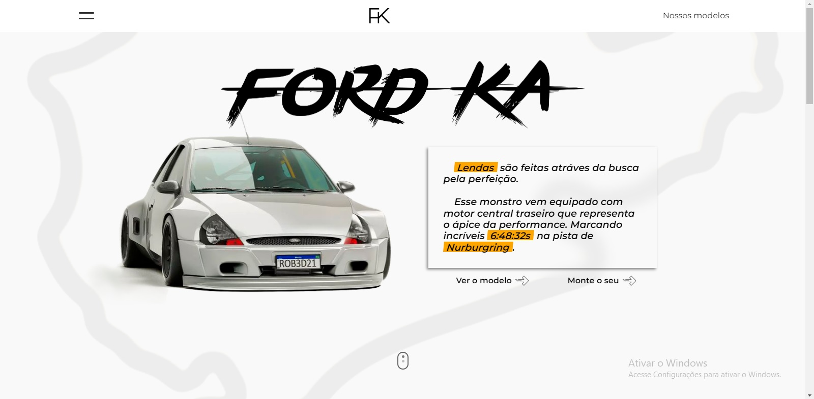

# Website de loja de carro.

__Colocando em prática conhecimentos de desenvolvedor FrontEnd.

__Ferramentas utilizadas neste projeto:
Photoshop,
CorelDraw,
ReactJS,
React Router,
ChatGPT

Carro que será usado foi criado pelo artista Brasileiro Robert Design.
Redes sociais do artista:
instagram.com/rob3rtdesign/
facebook.com/rob3rtdesign

